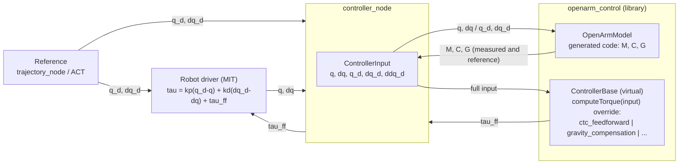

# control-toolbox + OpenArm (branch `openarm-ctc`)

This branch starts from the original [ETH ADRL control-toolbox](https://github.com/ethz-adrl/control-toolbox)
release `v3.0.2` (commit `7d36e42`, full upstream history kept) and adds the OpenArm control packages, so the
OpenArm model and controllers live next to the toolbox's own optimal-control solvers (`ct_optcon`: LQR, iLQR/GNMS
NLOC, MPC, DMS) and can use them directly. The upstream `README.md` is unchanged; this file describes the additions.

## What is in this branch

| Path | From | Content |
| --- | --- | --- |
| `ct_core`, `ct_optcon` | upstream | built by colcon on ROS 2 Humble (plain CMake packages) |
| `ct_optcon/examples` | upstream, **re-enabled** | NLOC (iLQR), NLOC_MPC, Kalman filters, constraint output; LQR with CppADCodeGen; DMS and NLP with IPOPT; constrained NLOC with HPIPM |
| `ct`, `ct_doc`, `ct_rbd`, `ct_models` | upstream | not built yet (`COLCON_IGNORE`): `ct` is a ROS 1 catkin metapackage, `ct_doc` is documentation, `ct_rbd`/`ct_models` need `kindr` and RobCoGen-generated models |
| `openarm/openarm_codegen` | OpenArm | offline generator: Pinocchio (CppADCodeGen scalar) + `ct::core::DerivativesCppadCG::generateForwardZeroSource` write the model as plain C++ |
| `openarm/openarm_control` | OpenArm | library, no node, **no Pinocchio at run time**: generated model (`generated/`: M, C, G per arm), `OpenArmModel`, `OpenArmDynamics` (`ct::core::ControlledSystem`), virtual `ControllerBase` with one common input, `ctc_feedforward`, `gravity_compensation`, `CtControllerAdapter` (`ct::core::Controller`) |
| `openarm/openarm_trajectory` | OpenArm | node `trajectory_node`: plays a trajectory, publishes `joint_commands` (q, dq) |
| `openarm/openarm_controller` | OpenArm | node `controller_node`: calls the library, publishes `controller/tau_ff`; launch file |
| `scripts/install_deps_ubuntu22.sh`, `docker/Dockerfile` | OpenArm | Ubuntu 22.04: ROS 2 Humble + Pinocchio + IPOPT + the toolbox dependencies pinned as in `ct/install_cppadcg.sh` and `ct/install_hpipm.sh` (CppAD 20200000.3, CppADCodeGen v2.4.3, BLASFEO 0.1.2, HPIPM 0.1.3) |
| `colcon.meta` | OpenArm | builds `ct_core` and `ct_optcon` with their examples; Python plotting of `ct_core` off (its matplotlib bridge fails with matplotlib ≥ 3.5, and the runtime stays Python-free) |
| `ct_core/CMakeLists.txt` | upstream, **1 fix** | `"${Python_VERSION_MAJOR}"` quoted so CMake configures when Python is disabled |

## Model: generated code (Pinocchio codegen), not RobCoGen

control-toolbox's own model path (`ct_rbd`) needs RobCoGen, which needs a `.kindsl` file (URDF → urdf2robcogen)
and RobCoGen 0.4 with Maxima. Instead the model is generated from the official URDF with Pinocchio and the toolbox's
code generator:

```
official URDF ──Pinocchio, CppADCodeGen scalar──▶ ct::core::DerivativesCppadCG ──▶ generated/OpenArm{Right,Left}Model.{h,cpp}
                (openarm_codegen, offline, ~30 ms)                                    input [q; dq] (7+7), output M, C, G
```

The generated files are plain C++ (straight-line arithmetic, about 1750 lines and 619 temporaries per arm) that
depend only on Eigen and `ct_core`. They match Pinocchio (double precision) to 1e-9 for M, C, G and inverse dynamics
on 40 random states; computing M, C, G of both arms at two states plus CTC takes about 6 µs. Regenerate after a URDF
change:

```bash
./install/openarm_codegen/lib/openarm_codegen/generate_model openarm/openarm_control/urdf/openarm_v1_bimanual.urdf \
    openarm/openarm_control/generated
python3 openarm/openarm_codegen/scripts/generate_golden.py <urdf> openarm/openarm_control/test/data/model_golden.csv  # reference values
```

## Control architecture



Every controller receives the same `ControllerInput`: measured `q, dq`, reference `q_d, dq_d, ddq_d`, and the model
terms `M, C, G` at the measured state (`in.measured`) and at the reference state (`in.reference`). The node computes
the model once per cycle and calls `controller->compute(in)`.

## Build and test

Ubuntu 22.04 (same as the integration side), no Docker needed:

```bash
./scripts/install_deps_ubuntu22.sh   # ROS 2 Humble + all toolbox/OpenArm dependencies (pinned versions)
source /opt/ros/humble/setup.bash
colcon build                        # from the repository root; colcon.meta sets the toolbox options
colcon test && colcon test-result --verbose
```

Checked on Ubuntu 22.04 (image built by the script): `colcon build` (6 packages), 11/11 tests, all 11 toolbox examples.

Any other host: `docker build -t openarm_toolbox:humble-ct -f docker/Dockerfile .` (runs the same script), then the same commands inside
`docker run --rm -it -v $PWD:/ws -w /ws openarm_toolbox:humble-ct bash`.

## Run

```bash
source install/setup.bash
ros2 launch openarm_controller trajectory_controller.launch.py       # trajectory + CTC feedforward
./build/ct_optcon/examples/ex_NLOC                                   # toolbox example: iLQR on an oscillator
```

Toolbox examples checked on this branch (Humble, GCC 11), all run to the end:

| Example | Method | Result printed |
| --- | --- | --- |
| `ex_LQR` | LQR, linearization by CppADCodeGen | gain matrix (the example ends with `return 1`) |
| `ex_NLOC` | iLQR / GNMS (nonlinear optimal control) | final cost 0.208 |
| `ex_NLOC_MPC` | MPC around NLOC | average solve delay 0.68 ms |
| `ex_NLOC_boxConstrained`, `ex_NLOC_generalConstrained` | constrained NLOC with HPIPM | final cost 947.1, 249.7 |
| `ex_DMS`, `ex_Nlp_2D`, `ex_Nlp_3D` | direct multiple shooting / NLP with IPOPT | objective 3.554, −2, −7.071 |
| `ex_KalmanFiltering`, `ex_KalmanDisturbanceFiltering` | Kalman filters | complete |
| `ex_ConstraintOutput` | constraint sparsity printout | printed (ends with `return 1`) |

Parameters are read once at start from `openarm/openarm_trajectory/config/trajectory.yaml` and
`openarm/openarm_controller/config/controller.yaml` (no defaults in the code; a missing parameter stops the node
with its name).

## Adding a controller (e.g. MPC)

1. Derive from `openarm_control::ControllerBase<NJ>` and override `computeTorque(const ControllerInput<NJ>&)`,
   `name()` and `clone()` (see `PdPlusGravity` in `openarm_control/test/test_openarm_control.cpp`).
2. Register the name in `makeController()` (`openarm_control/src/controller.cpp`).
3. Select it with `controller_type` in `controller.yaml`. Nodes, topics and the model stay the same.

For optimal control, `OpenArmDynamics` is the model as a `ct::core::ControlledSystem` (dx = [dq; M^-1(u - C dq - G)]),
which `ct_optcon` solvers accept; `CtControllerAdapter` runs any `ControllerBase` inside ct::core simulations.
